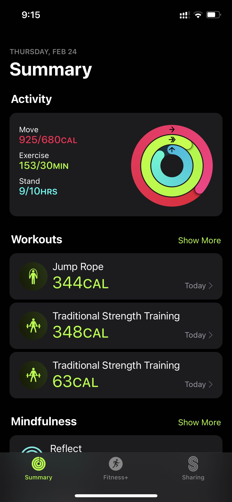
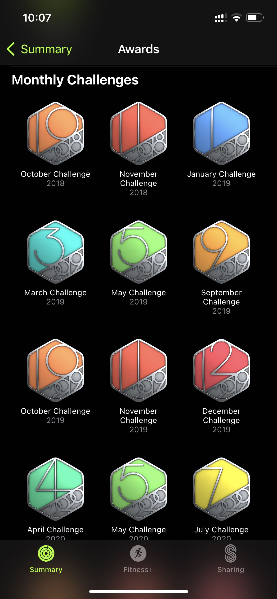
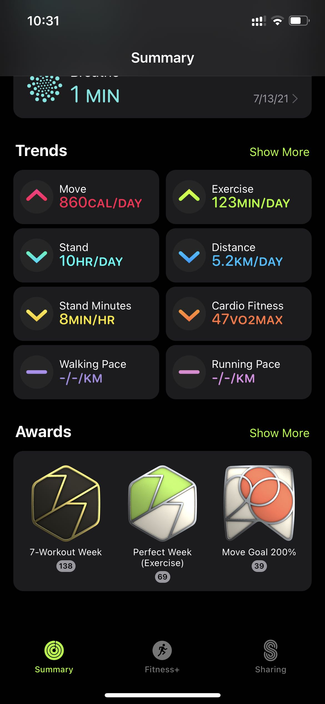

我目前已经购买了三款 Apple Watch, 说起来每次买的都是低配的版本，第一款是 S1，但是是在 Apple watch 推出的第三年，当时最新款是S3，第二款买的是 S3，也是买的这款开始减肥，现在用的 SE 蜂窝版本。

买 S1 的时候更多是抱着试一试的态度，当时并没有计划减肥，几乎没有运动习惯，所以买回来之后更多是查看通知，而且自己之前也没有戴手表的习惯，买回来后更多是在角落吃灰😂，当时也觉得一天一充太麻烦，这块手表几乎是放在角落里慢慢报废。

18 年开始减肥，当时我的 S1 已经坏了，刚开始买了小米的手环，手环相对手表体积更小，而且充电一次能用一周以上，但是手环记录运动必须配合手机一起使用，而且记录的运动种类也很有限。刚开始减肥的时候，我就是拿着手机跑步，但是当我跑步的配速快了一些的时候，发现带着手机跑步很不方便，我跑步的时候喜欢听音乐，手环也不支持，所以当时就计划买一块新的 Apple Watch。

到现在利用 Apple Watch 运动已经有三年多的时间，作为一款专注健康的智能设备，Apple Watch 内置了很多很实用的功能，下面是我使用最多的一些功能。

## 运动圆环

iOS 中 Fitness 应用的图标就是三个圆环，打开后是三个不同颜色的圆环，这三个圆环其实对应的是当天三个不同维度的运动数据，圆环从大到小分别表示，消耗的热量、运动时长和站立的时间，这三个圆环的进度就对应着你当时完成的进度，当然这三个圆环的目标值是可以随时在 Apple Watch 上更改，有了这三个圆环就能一眼了解当天的运动情况，我甚至把这个圆盘设置为了 Apple Watch 的表盘，这样能随时提示自己运动起来。

但是这个圆环也有一个弊端，圆环综合症，如果那天因为一些不可避免的原因没有合上圆环，会变得焦虑，会觉得这一天没有达到运动指标，不是健康的一天。我也经历过这样一段时间，但是后来随着次数越来越多，我也看开了😂，我们要知道这个圆环只是反应当天的运动情况，并不能衡量一天是否健康，Apple Watch 也只会在持续一周时间没有合上圆环时，给你发送一条提醒，所以一两天没有达成目标没有什么可焦虑的，以后的补上也不晚，而且 Apple Watch 也会在你超量或提早完成目标时，发通知鼓励。

## 运动提醒

Apple Watch 能随时检测运动状态，如果当前正在运动，但是没有打开运动记录，持续一段时间后，Apple Watch 会提醒是否正在运动，是否要打开 Workout App 记录运动，而且打开之后，记录的开始时间是运动开始的时间而不是发送提醒的时间。持续的时间也会根据不同的种类会有不同的时长，一般持续步行10分钟左右会收到提醒，但是比较剧烈的运动，例如跑步、Hiit 则在开始一到两分钟内就会收到提醒。

这个功能对步行特别友好，我经常是早上上班，在下地铁后步行到公司的这段距离会收到提醒(地铁离公司有一公里多😭)。

## 久坐提醒

Apple Watch 鼓励大家在每个小时内至少站立活动一分钟，如果接近一个小时内没有站立，通常会在50分钟的时候收到站立的提醒，工作日的时候我也是通常在这个时间摸摸鱼，起身去接杯水，然后上个厕所。

## 月度挑战

在每个月的月初会收到根据上个月的运动数据定制的月度挑战通知，每个月不一样，主要会在上月的平均的运动数据上加一点难度，完成后会收到一个月度挑战成功的徽章，当然还有很多其他漂亮的徽章，但是我对徽章没什么感觉，所以就没太在意徽章。

但是这个月度挑战也有点小问题，那就是会出现一些很极端的挑战目标，例如我有几次收到过燃烧3万多卡路里热量的目标，平均一天要消耗一千多卡路里，对于一个上班族这个难度是在是太高了，只要一个月内有一天加班了，没法完成目标的话，周末就要运动消耗两千多卡路里，这个就有点极限了，所以对于太极端的月度挑战我都是直接忽略。

## 运动趋势

运动趋势会比较最近三个月的平均数据和三个月之前一年内的平均数据，来告诉你最近的运动数据的趋势，是上升了还是下降了，会非常直观的用箭头表示。

这样看到不仅仅是今天的数据，而是最近一段时间的运动表现，而且是和自己以前的数据做比较，如果近期的确是懒惰了也能看出来，而不是靠一两天的努力来安慰自己。
