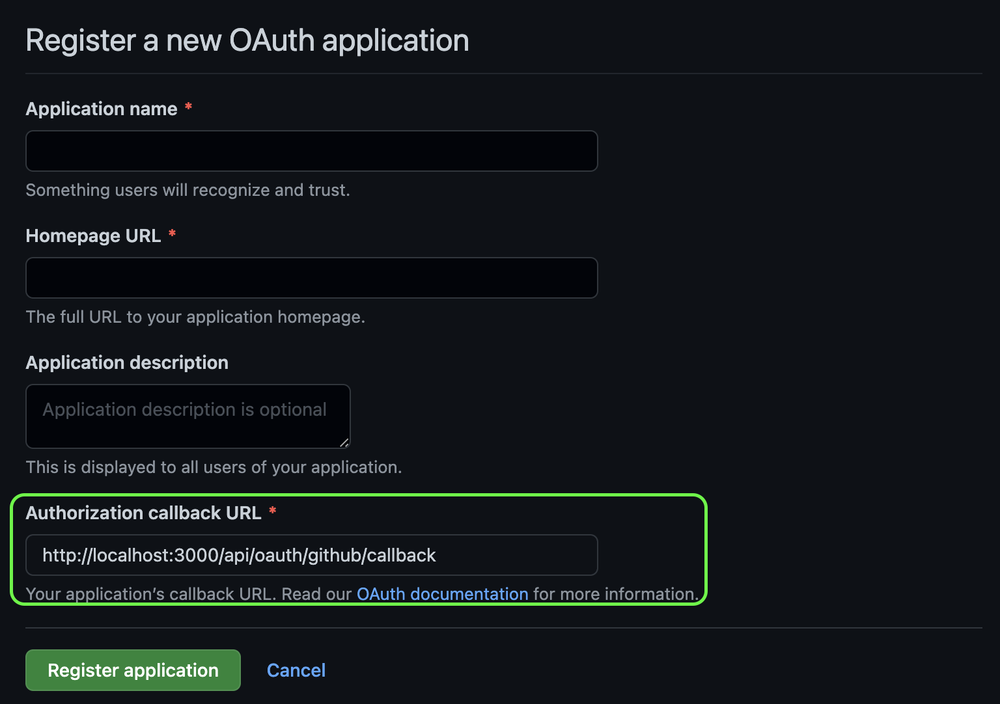

Next.js 提供了接口路由功能，可以用来添加一些简单的接口，我们可以利用 Github Oauth + JWT 实现一个简易的 Next.js 用户认证系统。(如果的你的网站只是使用 next.js 生成静态网站，然后部署到 Static hosting，例如 Github Pages，则无法运行 Next.js 接口路由功能)

## Github 登录

首先我们需要创建一个用于登录的 Github Oauth App，点击[这里](https://github.com/settings/applications/new)创建，其中 Authorization callback URL 请填写 http://localhost:3000/api/oauth/github/callback (上线后请创建一个新的应用填写线上的地址)



获取到 Client id 和 Client Secret 后写入到本地的环境变量配置文件 `.env.local`, 对应的 key 为 `GITHUB_CLIENT_ID`, `GITHUB_SECRET`

### 跳转用户到 Github 授权

Oauth 认证的第一步，需要跳转用户到对应的第三方网站进行应用授权，我们使用一个固定的链接，直接跳转到 Github 授权。

首先在环境变量文件中添加 `NEXT_PUBLIC_SITE_URL` 用于区别开发和线上的访问链接，本地的值为 `http://localhost:3000`, 然后创建文件 `/pages/api/connect/github.ts`

```typescript title="/pages/api/connect/github.ts"
import type { NextApiRequest, NextApiResponse } from 'next'

export default function handler(
  req: NextApiRequest,
  res: NextApiResponse
) {
  const redirectURL = `${process.env.NEXT_PUBLIC_SITE_URL}/api/oauth/github/callback`
  const url = `https://github.com/login/oauth/authorize?client_id=${process.env.GITHUB_CLIENT_ID}&redirect_uri=${encodeURIComponent(redirectURL)}&scope=user`
  res.redirect(url)
}
```

这样用户访问 `/api/connect/github` 就会跳转到 Github 授权页面

### 获取 Github 用户信息

Oauth 后面的步骤就是用户完成授权后，会跳转回我们在应用注册时填写的 `Authorization callback URL`，在页面 URL 中会加上 code 参数，使用 code 参数获取到 access_token, 然后利用 access_token 访问接口数据。
关于 Github Oauth 详细文档请参考 [Authorizing OAuth Apps](https://docs.github.com/en/developers/apps/building-oauth-apps/authorizing-oauth-apps)

创建 `/pages/api/oauth/github/callback.ts`

```typescript title="/pages/api/oauth/github/callback.ts"
import type { NextApiRequest, NextApiResponse } from 'next'
import axios from 'axios'
import cookie from 'cookie'
import { encode } from '../../../../lib/jwt'
import { User } from '../../../../types/user'

type GithubProfile = {
  login: string
  email: string
  blog?: string
  avatar_url: string
}

export default async function handler(
  req: NextApiRequest,
  res: NextApiResponse
) {
  const { code } = req.query
  if (!code) {
    res.status(401).json({"message": "bad request"})
    return
  }
  // 使用 code 获取 access_token
  const resp = await axios.post<{access_token: string}>(`https://github.com/login/oauth/access_token`, undefined, {
    params: {
      code,
      client_id: process.env.GITHUB_CLIENT_ID,
      client_secret: process.env.GITHUB_SECRET,
    },
    headers: {
      'Accept': 'application/json'
    }
  })
  const token = resp.data.access_token
  if (!token) {
    res.status(500).json(resp.data)
    return
  }
  // 使用 access_token 获取用户数据
  const userRes = await axios.get<GithubProfile>('https://api.github.com/user', {
    headers: {
      Authorization: `token ${token}`
    }
  })
  const user: User = {
    name: userRes.data.login,
    email: userRes.data.email,
    avatar: userRes.data.avatar_url,
    url: userRes.data.blog
  }
  // 通过 JWT 加密用户数据
  const userToken = encode(user)
  // 将加密后的数据写入 cookie
  const userCookie = cookie.serialize('user', userToken, { httpOnly: true, maxAge: 60 * 60 * 24 * 365, path: '/' })
  res.status(200).setHeader('Set-Cookie', userCookie).write(setupHTML(user))
  res.end()
}

function setupHTML(user: User) {
  return `
    <html>
      <head>
        <script>
          (function() {
            window.opener.postMessage(JSON.stringify({...${JSON.stringify(user)}, type: 'user'}))
            window.close()
          })()
        </script>
      </head>
    </html>
  `
}
```

我们使用新窗口完成 Github 认证，在获取到 Github 用户数据后，将数据加密后存储在 cookie 中，同时在请求响应中通过 postMessage 把用户数据传递到当前页面，完成后自动关闭认证页面，这样在不刷新页面的情况下完成用户认证。

### JWT 加密

由于我们并不使用数据库存储用户数据，而是直接将用户数据存储在 cookie 中，所以我们需要做一层加密，最常见的方式就是使用 JWT(JSON Web Tokens)

首先在环境变量文件中添加 `JWT_SECRET` 加密密码，然后创建 `/lib/jwt.ts`

```typescript title="/lib/jwt.ts"
import jwt from 'jsonwebtoken'

const JWT_SECRET = process.env.JWT_SECRET

export function encode(data: string | object) {
  return jwt.sign(data, JWT_SECRET)
}

export function decode<T>(token: string) {
  return jwt.verify(token, JWT_SECRET) as T
}
```


## 用户认证

### 用户验证

添加接口读取 cookie 中用户数据，创建 `/pages/api/user.ts`

```typescript title="/pages/api/user.ts"
import type { NextApiRequest, NextApiResponse } from 'next'
import cookie from 'cookie'
import { decode, encode } from '../../lib/jwt'

export default function handler(
  req: NextApiRequest,
  res: NextApiResponse
) {
  const userToken = req.cookies.user
  if (!userToken) {
    res.status(401).json({"message": "unauthorized"})
    return
  }
  try {
    const user = decode(userToken)
    res.status(200).json(user)
  } catch (e) {
    res.status(401).json({"message": "unauthorized"})
  }
}
```

### 用户退出

添加接口清除用户 cookie 即可退出用户登录，创建 `/pages/api/logout.ts`

```typescript title="/pages/api/logout.ts"
import type { NextApiRequest, NextApiResponse } from 'next'
import cookie from 'cookie'

export default function handler(
  req: NextApiRequest,
  res: NextApiResponse
) {
  const userCookie = cookie.serialize('user', '', { httpOnly: true, expires: new Date(), path: '/' })
  res.status(200).setHeader('Set-Cookie', userCookie)
  res.json({"message": "ok"})
}
```

### 用户上下文(React Context)

完成后端接口后，我们创建上下文处理用户认证，创建文件 `/context/auth/provider.tsx`

```tsx title="/context/auth/provider.tsx"
import { createContext, PropsWithChildren, useCallback, useEffect, useState } from "react"
import { User } from "../../types/user"

export type AuthContext = {
  user?: User
  login: () => Promise<User>
  logout: () => Promise<void>
}

export const AuthProviderContext = createContext<AuthContext>({
  login: () => Promise.reject(),
  logout: () => Promise.reject(),
})

export function AuthContextProvider({ children }: PropsWithChildren<{}>) {
  const [user, setUser] = useState<User>()

  const login = useCallback(() => {
    const loginWindow = window.open('/api/connect/github', 'loginWindow', 'height=500,width=500')
    return new Promise<User>((resolve, reject) => {
      if (!loginWindow) return reject()
      const messageHandler = (e: MessageEvent) => {
        try {
          const data = JSON.parse(e.data)
          if (data.type === 'user') {
            setUser(data)
            resolve(data)
          }
        } catch (e) { }
      }
     window.addEventListener('message', messageHandler)
    })
  }, [])

  const logout = useCallback(async () => {
    await fetch(`/api/signout`)
    setUser(undefined)
  }, [])

  useEffect(() => {
    fetch(`/api/user`)
      .then(res => {
        if (res.status !== 200) {
          return Promise.reject(res.status)
        }
        return res.json()
      })
      .then(user => setUser(user))
      .catch(() => {})
  }, [])

  return (
    <AuthProviderContext.Provider value={{ user, login, logout}}>
      { children }
    </AuthProviderContext.Provider>
  )

}
```

更新 `/pages/_app.tsx` 文件

```tsx title="/pages/_app.tsx"
import '../styles/globals.css'
import type { AppProps } from 'next/app'

function MyApp({ Component, pageProps }: AppProps) {
  return (
    <AuthContextProvider>
      <Component {...pageProps} />
    </AuthContextProvider>
  )
}

export default MyApp
```

这样我们在任意页面和组件使用上下文，获取当前登录用户，调用登录、退出方法。

在登录环节可以把 Github 换成其他任何第三方，或者使用 passport.js 做处理。


