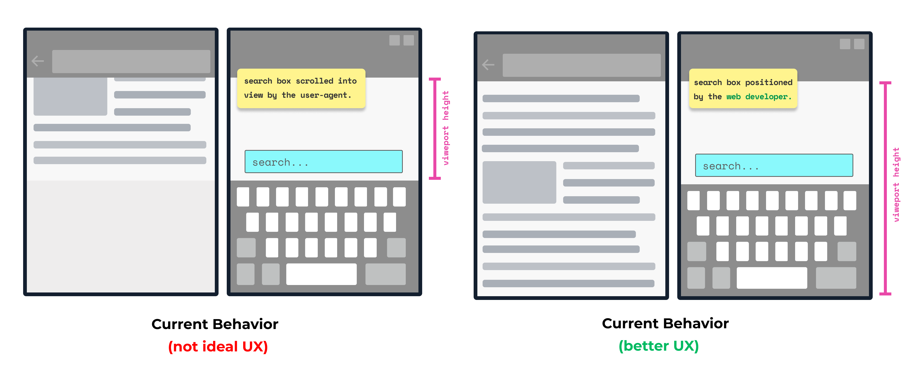

平板电脑或手机等设备通常具有用于输入文本的虚拟键盘，与始终存在且相同的物理键盘不同，虚拟键盘的出现和消失取决于用户的操作，或者通过属性更改，例如[inputmode](https://developer.mozilla.org/docs/Web/HTML/Global_attributes/inputmode)属性。

这种灵活性的代价是浏览器的布局引擎必须知道虚拟键盘是否显示，并且可能需要调整文档布局，例如，用户点击的输入框可能会被虚拟键盘挡住，所以浏览器必须滚动页面使输入框在视图内。

通常，浏览器会通过下面的方式响应虚拟键盘显示，并不会暴露任何信息给开发人员。

1. 重新定位到虚拟键盘上方
2. 减小视图的高度，确保不会被被虚拟键盘遮挡
3. 减小可视视图的大小并填充布局视图以确保移动到虚拟键盘上方

虚拟键盘 API 允许浏览器保持布局和可视窗口不变，并且提供虚拟键盘和视图窗口的信息，从而让让开发者通过 Javascript 或者 CSS 环境变量自定义页面布局。



虚拟键盘 API 分为三个部分

1. `navigator` 对象上的 `VirtualKeyboard` 接口，用于使用 JavaScript 控制虚拟键盘
2. CSS 环境变量，提供有关虚拟键盘外观的信息
3. 确定是否应显示虚拟键盘的虚拟键盘策略

## 浏览器支持探测

以下代码片段可检测当前浏览器是否支持 VirtualKeyboard API

```javascript
if ('virtualKeyboard' in navigator) {
  // The VirtualKeyboard API is supported!
}
```

## 使用 VirtualKeyboard API

VirtualKeyboard API 为 `navigator` 对象添加了一个新接口 VirtualKeyboard

### 使用新的虚拟键盘

告诉浏览器自己处理虚拟键盘遮挡，首先需要将属性 `overlaysContent` 设置为 `true` 

```javascript
navigator.virtualKeyboard.overlaysContent = true;
```

### 显示和隐藏虚拟键盘

可以通过调用 `show()` 方法显示虚拟键盘，焦点元素需要是表单控件（例如 `textarea` 元素），或者是可编辑元素（例如，通过使用 `contenteditable` 属性），该方法始终返回 `undefined` 并触发 `geometrychanged` 事件

```javascript
navigator.virtualKeyboard.show();
```

要隐藏虚拟键盘，请调用 hide() 方法。该方法总是返回 `undefined` 并触发 `geometrychanged` 事件。

```javascript
navigator.virtualKeyboard.hide();
```

### geometrychanged 事件

每当虚拟键盘出现或消失时，都会触发 `geometrychanged` 事件，事件的 `target` 属性包含新虚拟键盘信息的 [`DOMRect`](https://www.w3.org/TR/geometry-1/#domrect) 对象

```javascript
navigator.virtualKeyboard.addEventListener('geometrychanged', (event) => {
  const { x, y, width, height } = event.target;
  console.log('Virtual keyboard geometry changed:', x, y, width, height);
});
```

### 获取当前 geometry

您可以通过查看 `boundingRect` 属性来获取虚拟键盘的当前的 geometry, 它将虚拟键盘的当前尺寸暴露为 [`DOMRect`](https://www.w3.org/TR/geometry-1/#domrect) 对象

```javascript
const { x, y, width, height } = navigator.virtualKeyboard.boundingRect;
console.log('Virtual keyboard geometry:', x, y, width, height);
```

## CSS 环境变量

VirtualKeyboard API 提供了一组 CSS 环境变量，提供有关虚拟键盘外观的信息，类似于 inset CSS 属性，即对应于顶部、右侧、底部和/或左侧的属性

- `keyboard-inset-top`
- `keyboard-inset-right`
- `keyboard-inset-bottom`
- `keyboard-inset-left`
- `keyboard-inset-width`
- `keyboard-inset-height`

环境变量定义了虚拟键盘到可视窗口边缘上、右、下、左的距离

通常会使用以下示例中的环境变量

```css
.some-class {
  /**
   * Use a margin that corresponds to the virtual keyboard's height
   * if the virtual keyboard is shown, else use the fallback value of `50px`.
   */
  margin-block-end: env(keyboard-inset-height, 50px);
}

.some-other-class {
  /**
   * Use a margin that corresponds to the virtual keyboard's height
   * if the virtual keyboard is shown, else use the default fallback value of `0px`.
   */
  margin-block-end: env(keyboard-inset-height);
}
```

## 虚拟键盘策略

`virtualkeyboardpolicy` 属性可以控制虚拟键盘是否自动出现，允许的值为 `auto` 和 `manual`

```html
<!-- 双击时才出现虚拟键盘 -->
<div
  contenteditable
  virtualkeyboardpolicy="manual"
  inputmode="text"
  ondblclick="navigator.virtualKeyboard.show();"
>
  Double-click to edit.
</div>
```

### 参考链接

- [Specification](https://w3c.github.io/virtual-keyboard/)
- [Repository](https://github.com/w3c/virtual-keyboard/)
- [ChromeStatus entry](https://chromestatus.com/features/5680057076940800)
- [Chromium bug](https://bugs.chromium.org/p/chromium/issues/detail?id=856269)
- [W3C TAG review](https://github.com/w3ctag/design-reviews/issues/507)
- [Mozilla standards position request](https://github.com/mozilla/standards-positions/issues/531)
- [WebKit standards position request](https://lists.webkit.org/pipermail/webkit-dev/2021-May/031862.html)
- [Full control with the VirtualKeyboard API](https://web.dev/virtualkeyboard/)

